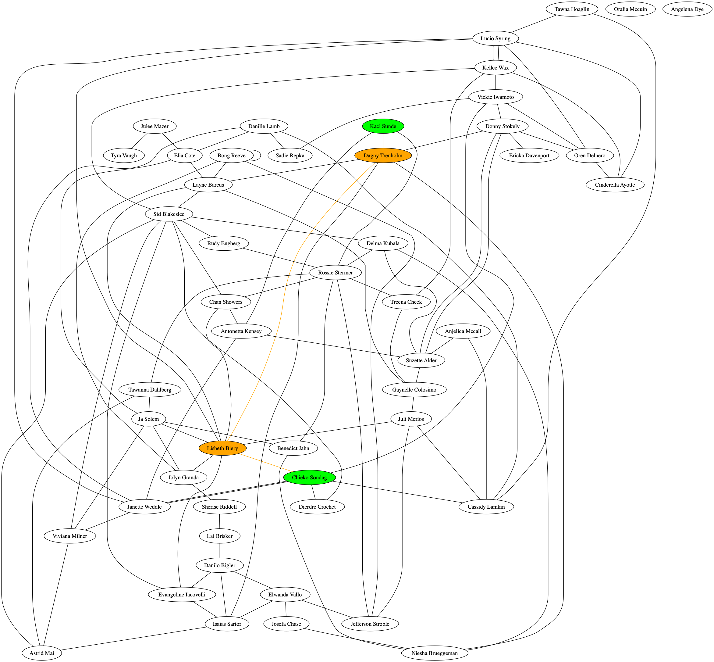

# Shoreline
This repository was motivated by a problem submitted on a job offer. Sections [Problem](#problem) and [Instructions](#instructions) describe company's expectation. Other ones explain the choices I made to implement it and my answers to the questions.

## <a name="problem">Problem</a>

We are building a social network.  In this social network, each user has friends.

A chain of friends between two users, user A and user B, is a sequence of users starting with A and ending with B, such that for each user in the chain, ua, the subsequent user, ua + 1, are friends.

Given a social network and two users, user A and user B, please write a function that computes the length of the shortest chain of friends between A and B.

## <a name="instructions">Instructions</a>
Please write answers to the following discussion questions and include them in your solution as comments:

* How did you represent the social network?  Why did you choose this representation?
* What algorithm did you use to compute the shortest chain of friends?  What alternatives did you consider?  Why did you choose this algorithm over the alternatives?
* Please enumerate the test cases you considered and explain their relevance.

## Implementation
### Choices
I found this problem interesting and thought it would be beneficial to open it to a wider audience by structuring it as a workshop:
* number of nodes or edges can easily be changed in [Utils.hs](src/Utils.hs),
* edges are randomly generated,
* if Graphviz is installed on the machine, a [png](graph.png) of the graph is generated after computation.

By default there are 50 nodes to keep the graph readable.  
Random name generator are easy to find, I used [listofrandomnames.com](http://listofrandomnames.com/) but [randomwordgenerator.com](https://randomwordgenerator.com/name.php) allows bigger lists.

### Usage
This is a usual Stack project: clone it, open a terminal and use `stack build`, `stack run`, `stack test` or `stack repl` according to your needs.

### Answers
* How did you represent the social network?  Why did you choose this representation?  

This is a typical example of a **graph**.  
Because nothing defines edges, it is **unweighted**. Friendship is supposed to be mutual, so edges are **undirected**.  

* What algorithm did you use to compute the shortest chain of friends?  What alternatives did you consider?  Why did you choose this algorithm over the alternatives?  

**Breadth-first search (BFS)** is the appropriate algorithm for searching a tree or data structure. It has a time complexity of *O(V + E)*, meaning every vertex and every edge will be explored in the worst case. This linear complexity gives good performance.  
Dijkstra's Shortest Path is another popular algorithm but it is used with weighted graphs. It could be used with the same arbitrary weight for every edge but its time complexity is *O(E + VlogV)*. Bellman-Ford is another algorithm for weighted graphs running in *O(VE)* time.  

[Functional programming with graphs](https://futtetennismo.me/posts/algorithms-and-data-structures/2017-12-08-functional-graphs.html) is a very interesting post on algorithm implementations in Haskell. The "Breadth-first search" section explains clearly how the algorithm works and gives insight in its Haskell version.  

The [Functional Graph Library](http://hackage.haskell.org/package/fgl) on Hackage gives the implementation of BFS used here.  
The function `esp :: Graph gr => Node -> Node -> gr a b -> Path` (edges shortest path) uses a BFS algorithm under the hood. The graph is a PatriciaTree.

* Please enumerate the test cases you considered and explain their relevance.  

Here they are:   

Besides the obvious test whether the shortest path is found or not, it is important to test the algorithm against a **cyclic graph** to see if nodes are explored only once. The last test check the **time complexity** with a huge number of edges. 